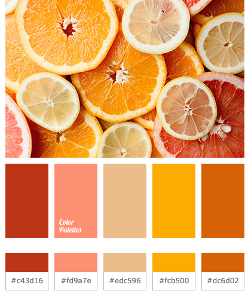
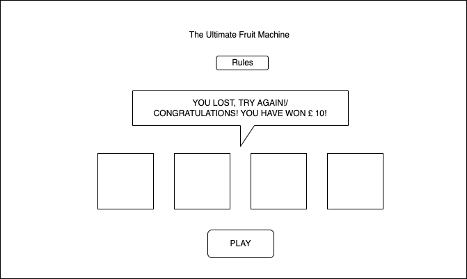

# The Ultimate Color Matching Machine

Phorest Graduate Programme Technical Challenge

Problem:
We are going to create a virtual fruit machine. To make things easier instead of symbols we are going to use colours: black, white, green, yellow.
Each time a player plays our fruit machine we display four 'slots' each with a randomly selected colour in each slot.
If the colours in each slot are the same then the player wins the jackpot which is all of the money that is currently in the machine.
Implement a basic machine, along with the concept of a player who has a fixed amount of money to play the machine.

Solution:
You can choose between two options to complete this challenge

1. In a Javascript framework of your preference or Vanilla Javascript, implement a web client that:
a. Displays the four slots
b. Allows the user to play the game
c. Alerts the user if they won or lost.
d. Increases/Decreases money in the machine

2. Implement the game API in any backend framework(Java, Ruby etc.) of your preference which
a. Can be called to play the game
b. Returns the 4 slot colours
c. Returns a win or lose status.
d. Increases/Decreases the money in the machine

Success Criteria:
- Clean code
- Documentation
- Automated tests
- The path to your solution, please share with us your solution on Github with the history of your steps.

## Overview

Looking at the challenge requirements, I have decided to take the first approach which is built a frontend application using Vanilla JavaScript.

The project can be divided into four sections:

- Display the four slots.
- A play button to start the game.
- A popup to inform the user lose/win.
- Bank the money for each play, and display the jackpot amount when a user wins.

## [Contents](#contents)

[UX](#ux)

- [User stories](#user-stories)

- [Design](#design)

- [Wireframes](#wireframes)

[Features](#features)

[Technoloies Used](#technologies-used)

[Deployment](#deployment)

[Testing](#testing)

[Credits](#credits)

## [Livesite](https://melindazhang2020.github.io/ultimate-color-matching-machine/)

## UX

### User stories

Overall user expectations

- Easy to navigate/play
- Intuitive
- Visually pleasing

|As a...  |I want to... |So I can... |
|-----|---|---|
| user|Immediately understand the purpose of the site| Decide whether to stay or leave|
|  | Find the rules of how to play the game | Know how to play|
|  | Be informed win/lose after each play| Know if win/lose|
|  | Be informed how much did I win | Know the amount of the money has been won|

### Design

Color Scheme 

Although the design part of this challenge isn't very important, I still picked a main color scheme idea just to have it at the back of my mind. And also for future refenrences if I am going to develop it further.

### Wireframes

## Features

- Rules (clickable popup)
- Winning Display with the amount of money won
- Money Bag Display
- Slots Display
- Play Button
- Restart Button
- Restart game automatically in 10 seconds after a Jackpot
- Alert user when money bag is empty

## Technologies Used

- HTML
- CSS
- Vanilla JavaScipt
- Boostrap 5.1

## Deployment

- Github pages

## Testing

### User Stories Testing

#### As a user, I want to...

**Immediately understand the purpose of the site**

- The site name immediately spell out the purpose and the tone of the site, it's a Color Matching game site.
- The four slots gives the user a visaul guess.

**Find the rules of how to play the game**

- The Rules button serves this demand. It pops up when click. The cursor indicate the button is clickable.

**Be informed win/lose after each play| Know if win/lose**

- The money bag deducts money when the color doesn't match up.

- A winning message is displayed if all four slots colors matched up.

**Be informed how much did I win | Know the amount of the money has been won**

- The total amount of the money won is displayed inside the winning messages.

### Manual Testing

| **Element** | **Action**|  **Expected Result** |  **Pass/Fail** |
|---|---|---|---|
|**Rules Button**|click| opens up a claspable display the rules| Pass|
|**Play Button**|click| starts the game, display random colors individually in each slot| Pass|
|**Restart Button**|click| Reload the game, money bag counter reset to 20| Pass|
|**Money Bag Amount Display**|none|display hidden as default, shows up as soon as the game starts| Pass|
|**Winning Message Display**|none|display hidden as default, shows up as soon as a Jackpot happens| Pass|
|**Restart Game in 10 seconds Countdown**|none|display hidden as default, shows up as soon as a Jackpot happens| Pass|
|**Alert Message Disaplay**|shows up as soon as the money bag runs down to 0, click ok to restart the game| Pass|

### Responsiveness Testing

The site has been designed with a mobile-first philosophy using flexbox and media query.

Tested with [Responsive Viewer](https://chrome.google.com/webstore/detail/responsive-viewer/inmopeiepgfljkpkidclfgbgbmfcennb?hl=en) for the following devices, accounting for mininum screen width of 320px:

- iPhone 5/5SE, 320x568

- iPhone XS,X, 375x812

- Galaxy S9 Plus, 412x846

- Galaxy S9 Note 8, 360x740

- Pixel 3, 3 XL, 393x786

- iPhone 8 Plus, 7 Plus, 414x736

- iPad Mini, 768x1024

- iPad Pro, 834x1112

- Medium Screen, 1024x800

- Large Screen, 1280x800

## Credits

### stack overflow 

[Random Color From Array](https://stackoverflow.com/questions/14949011/random-color-from-array)

[Check if all values of array are equal](https://stackoverflow.com/questions/14832603/check-if-all-values-of-array-are-equal)

[counts down from 30 seconds](https://stackoverflow.com/questions/4435776/simple-clock-that-counts-down-from-30-seconds-and-executes-a-function-afterward)

### youtube 

[Slot Machine game](https://www.youtube.com/watch?v=QdnzQTGF1xc)